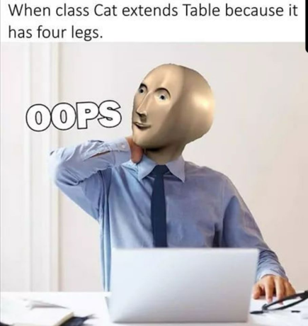

# Game-Dev-TC-modul-2
Modul 2 Komunitas Game Dev TC 2020

## Tujuan
1. Peserta memahami konsep Pemrograman Berorientasi Objek
2. Peserta dapat mengimplementasi Pemrograman Berorientasi Objek
3. Peserta dapat memahami bahasa C#
4. Peserta dapat menggunakan bahasa C#

## Apa itu Pemrograman Berorientasi Objek ?
Pemrograman berorientasi objek adalah teknik pemrograman dimana setiap fungsi dan data akan dikelompokkan. Tujuan dari pemrograman ini, adalah untuk mengurangi *code duplication* dan *dependency* yang merupakan kekurangan *procedural programming*.
Dalam *procedural programming*, akan disediakan fitur seperti variabel dan fungsi. Namun, fungsi dan variabel ini dapat diakses di semua scopenya. Jadi kita tidak bisa menyembunyikan variabel atau fungsi. Ini sangat tidak praktis, jika ada project besar dengan ratusan variabel dimana semua variabel dapat diakses dimanapun. Ini adalah permasalahan yang ingin diselesaikan oleh *object oriented programming*.
Dengan *object oriented programming*, kita dapat mengelompokkan fungsi dan variabel ini sesuai dengan yang membutuhkan mereka.
Liat contoh *procedural programming* berikut :
```
#include <stdio.h>

void Move(int * x, int * y, int deltaX, int deltaY){
    *x+=deltaX;
    *y+=deltaY;
}

int main(){
    int playerX, playerY;
    int playerHealth = 10;
    int enemyX, enemyY;
    int enemyHealth = 10;
    Move(&playerX, &playerY, 1, 1);
    ...
    
}
```
Bandingkan dengan contoh *object oriented programming* berikut :
```
class Player {
    private int x, int y;
    private int health;

    public void Move(int deltaX, int deltaY){
        x+=deltaX;
        y+=deltaY;
    }
}

class Main : MonoBehaviour{
    void Start(){
        Player player = new Player();
        player.Move(1, 1);
        ...
    }
}
```
## 4 Prinsip dalam Pemrograman Berorientasi Objek
Pemrograman berorientasi objek mempunyai 4 prinsip, yaitu *Encapsulation*, *Abstraction*, *Inheritance*, dan *Polymorphism*. Setiap bahasa pemrograman berorientasi objek harus mensupport 4 prinsip tersebut.

### Encapsulation
*Encapsulation* adalah mekanisme untuk *membungkus* variabel dan fungsi yang mempunyai tujuan atau tanggung jawab yang sama. Dengan ini, beberapa variabel atau fungsi dapat *dilindungi* dari luar. Perlindungan ini, membuat kita mengurangi dependency antar class.
Hanya beberapa fungsi atau variabel saja yang dapat diakses dari luar memudahkan untuk refactor code atau memperbaiki suatu fitur. Dengan beberapa fungsi yang tersembunyi ini, bisa diubah tanpa merusak keseluruhan program karena fungsi fungsi tersebut hanya dipanggil di *scope* class saja.
Contoh kode tidak menerapkan *encapsulation* :
```
#include <stdio.h>

void Attack(int attack, int * opponentHP){
    *oponentHP -= attack;
}

int main(){
    ...
    int playerAttack = 5;
    int playerBuff = 1;
    int enemyArmour = 2;
    int enemyHealth = 10;
    Attack(playerAttack+playerBuff-enemyArmour, &enemyHealth);
    ...
    
}
```
Contoh kode menerapkan *encapsulation* :
```
class Enemy{
    ...
    private int health = 10;
    private int armour = 4;

    public void Damaged(int ap){
        health -= ap-armour;
    }
}

class Player{
    ...
    private int attackPoint = 4;
    private int attackBuff = 2;

    public void Attack(Enemy enemy){
        enemy.Damaged(attackPoint + attackBuff);
    }
}

class Main : MonoBehaviour{
    void Start(){
        Player player = new Player();
        Enemy enemy = new Enemy();
        player.Attack(enemy);
    }
}
```

### Abstraction
*Abstraction* adalah proses untuk menyembunyikan implementasi suatu fungsi, namun tetap memberikan fungsionalitas ke user. Dengan ini, programmer tidak perlu mengetahui cara kerja fungsi tersebut, hanya perlu tahu apa kegunaan dari fungsi tersebut.
Dalam *object oriented programming* sangat dianjurkan implementasi itu di implementasikan di class namun di definisikan di abstract class atau interface. Abstraksi sangat diperlukan untuk mengurangi detail yang perlu diketahui user.
Contoh dalam mobil, ada pedal gas dan rem. Kita tidak mempedulikan bagaimana mobil menggerakkan mesinnya, tapi kita hanya peduli bahwa pedal gas kalau ditekan akan menggerakkan mobil kedepan.
Contoh kode yang tidak mengimplementasi *abstraction* :
```
class Enemy{
    ...
    public int health = 10;
    public int armour = 4;

    public void Die(){
        ...
    }
}

class Player{
    ...
    private int attackPoint = 4;
    private int attackBuff = 2;

    public void Attack(Enemy enemy){
        enemy.health -= attackPoint + attackBuff - enemy.armour;
        if(enemy.health < 0){
            enemy.Die();
        }
    }
}

class Main : MonoBehaviour{
    void Start(){
        Player player = new Player();
        Enemy enemy = new Enemy();
        player.Attack(enemy);
    }
}
```
contoh kode yang mengimplementasi *abstraction* :
```
class Enemy{
    ...
    private int health = 10;
    private int armour = 4;

    public void Damaged(int ap){
        health -= ap-armour;
        if(health < 0){
            Die();
        }
    }

    private void Die(){
        ...
    }
}

class Player{
    ...
    private int attackPoint = 4;
    private int attackBuff = 2;

    public void Attack(Enemy enemy){
        enemy.Damaged(getAttackPoint());
    }

    private int getAttackPoint(){
        return attackPoint + attackBuff;
    }
}

class Main : MonoBehaviour{
    void Start(){
        Player player = new Player();
        Enemy enemy = new Enemy();
        player.Attack(enemy);
    }
}
```
### Inheritance
*Inheritance* adalah saat dimana satu class mendapatkan properti atau fungsi dari class parent atau class yang diturunkan. Konsep *inheritance* adalah seperti kucing dan anjing adalah mamalia. Dimana semua mamalia akan menyusui dan bernapas dengan paru-paru. Jika kucing dan anjing tidak *inherit* mamalia, maka kita harus menulis ulang fungsi-fungsi yang sama tadi.
Jadi tujuan utama inheritance adalah mengurangi *code duplication*. Akan tetapi dengan adanya inheritance harus dipahami juga bahwa akan ada dependency antara child class dan parent class. Jadi inheritance harus digunakan sebaik-baiknya. Misal contoh inheritance yang kurang baik :


contoh kode yang tidak mengimplementasi *inheritance* :
```

class Orc : Enemy {
    protected int health;
    protected int attackPoint;

    public Orc(){
        health = 5;
        attackPoint = 2;
    }

    public void Attack(Player player){
        player.Damaged(attackPoint);
    }

    public void Damaged(int damage){
        health -= damage;
    }

}

class Elf : Enemy {

    protected int health;
    protected int attackPoint;

    public Elf(){
        health = 2;
        attackPoint = 3;
    }

    public void Attack(Player player){
        player.Damaged(attackPoint);
    }

    public void Damaged(int damage){
        health -= damage;
    }

}

```

contoh kode yang mengimplementasi *inheritance* :
```
abstract class Enemy {
    protected int health;
    protected int attackPoint;

    public void Attack(Player player){
        player.Damaged(attackPoint);
    }

    public void Damaged(int damage){
        health -= damage;
    }
}

class Orc : Enemy {

    public Orc(){
        health = 5;
        attackPoint = 2;
    }

}

class Elf : Enemy {

    public Elf(){
        health = 2;
        attackPoint = 3;
    }

}

```
### Polymorphism
Polymorphism berarti berbagai bentuk. Suatu objek dalam *object oriented programming* dapat dilihat sebagai beberapa bentuk. Bentuk polymorphism dapat dilihat di dunia nyata. Misalkan ayam merupakan unggas dan ovipar. Ayam dapat dilihat hanya sebagai ovipar saja dan kita tahu bahwa semua yang ovipar bisa bertelur, jadi objek tersebut bisa bertelur.
Saat suatu class meng-*extend* class lain atau meng-*implement* beberapa interface. Maka class tersebut akan bisa disimpan dalam bentuk class atau interface tersebut.
```
interface IDamageable{
    void Damaged(float damage);
}

abstract class Enemy : IDamageable {

    private float attackPoint;
    private float health;

    public abstract void Move();

    public void Attack(IDamageable other){
        other.Damaged(attackPoint);
    }

    public void Damaged(float damage){
        health -= damage;
    }
}

class Orc : Enemy {

    public Orc(){
        health = 5;
        attackPoint = 2;
    }

    public void Move(){
        //lari
    }

}

class Bat : Enemy {

    public Bat(){
        health = 2;
        attackPoint = 3;
    }

    public void Move(){
        //terbang
    }

}

class Main : MonoBehaviour{

    void Start(){
        Enemy enemy1 = new Bat();
        Bat bat = (Bat)enemy1;
        enemy1.Move();
        ((IDamageable) bat).Damaged(1);
        enemy1 = new Orc();
    }

}
```

## C#
Bahasa yang akan digunakan dalam Unity adalah C#. Jadi kali ini kita akan belajar bahasa C# dan bagaimana mengimplementasi OOP dalam C#.

### class dan object
Class adalah template suatu object. Sedangkan object adalah *instance* dari sebuah class. Dalam class, kita mendefinisikan variabel dan fungsi yang ada dalam class tersebut. Sedangkan, object adalah *instance* dari class yang merupakan hasil pembuatan di memory.
Untuk mendefinisikan class, kita menggunakan keyword ```class```. Dilanjutkan dengan nama class tersebut lalu curly bracket.
```
public class NamaClass {
    private int variabel1;
    private float variabel2;
    public string variabel3;

    private void Fungsi1(){

    }
    protected void Fungsi2(){

    }
    public void Fungsi3(){

    }
}
```
Dalam class, kita dapat mendefinisikan properti dan method. Untuk setiap object yang dibuat dengan template NamaClass, akan mempunyai fungsi dan variabel tersebut. Untuk membuat sebuah objek kita harus memanggil constructor atau memanggil ```new NamaClass(param)```.

### constructor
Constructor adalah blok kode yang akan dieksekusi saat pembuatan *instance* suatu class. Nama constructor harus sama dengan nama class dengan access modifier public. Class dapat mempunyai lebih dari satu constructor asalkan mempunyai parameter yang berbeda.
```
class ContohClass {
    public ContohClass(){
        //kode ini akan dijalankan saat menggunakan new ContohClass()
    }
    public ContohClass(int angka){
        //kode ini akan dijalankan saat menggunakan new ContohClass(int)
    }
}
```

### access modifier
Untuk mengimplementasi *abstraction* dan *encapsulation*, kita harus bisa memberikan modifier pada variabel dan method. Semua method dan variabel dapat diberi keyword untuk memodifikasi dari mana properti tersebut dapat diakses.

#### private
variabel dan fungsi hanya dapat diakses di dalam class sendiri.
```
class Contoh{
    private int test;
    private void testFunc(){

    }
}
```

#### protected
variabel dan fungsi dapat diakses di dalam class sendiri dan child classnya.
```
class Contoh{
    protected int test;
    protected void testFunc(){

    }
}
```

#### public
variabel dan fungsi dapat diakses di class manapun.
```
class Contoh{
    public int test;
    public void testFunc(){

    }
}
```

#### static
Variabel dan fungsi dengan kata kunci static tidak terikat oleh object. Jadi akan selalu dialokasikan saat program mulai. Variabel static dapat mempunyai modifier public, protected, dan private. Untuk mengakses variable static, dapat menggunakan ```NamaClass.namaVariabel```
```
Class ClassA {
    public static int staticVar = 0;
    private static int classInstanceCount = 0;

    public ClassA(){
        classInstanceCount++;
    }

    public static void ShowInstanceCount(){
        Debug.Log(classInstanceCount);
    }
}

class Main : MonoBehaviour{
    void Start(){
        Debug.Log(ClassA.staticVar);
        ClassA.ShowInstanceCount();
        ClassA c = new ClassA();
        ClassA.ShowInstanceCount();
    }
}
```

### Reference
Setiap object dalam c# akan ditunjuk menggunakan referensi. Referensi tersebut akan di-*return* saat kita membuat objek baru. Dalam kode berikut, hanya ada 1 objek saja.
```
class ExampleClass{
    public int number;
}
class Main : MonoBehaviour{
    void Start{
        ExampleClass varA = new ExampleClass();
        varA.number = 1;
        ExampleClass varB = varA;
        Debug.Log(varA.number + " " + varB.number);
        varB.number = 2;
        Debug.Log(varA.number + " " + varB.number);
    }
}
```
Dapat dicoba, maka output dari program tersebut adalah 1 1 dan 2 2. Itu dikarenakan varA dan varB mereferensikan ke object yang sama.

### Inheritance
Untuk meng-*extend* atau meng-*implementasi* dalam C# dapat menggunakan symbol ```:``` dan untuk memisahkan interface dengan class. Untuk semua fungsi dan variabel class yang ada di parent class pasti akan diturunkan ke child class. Akan tetapi private variabel yang ada di parent class tidak akan bisa diakses secara langsung oleh child class. Selain itu, kita juga bisa melakukan Method overriding.

#### Method Overriding
Dalam inheritance, mungkin kita mau child class melakukan sesuatu yang berbeda pada suatu fungsi yang ada di parent class. Kita bisa meng-*override* atau mengganti fungsi yang ada di parent class. Dengan ini pada fungsi yang sama akan melakukan hal yang berbeda pada fungsi yang di override. Fungsi yang di-*override* harus mempunyai keyword virtual di fungsinya.

```
class ParentClass{
    public virtual void Function1(){
        Debug.Log("Parent Class function 1");
    }

    public virtual void Function2(){
        Debug.Log("Parent Class function 2");
    }
}

class ChildClass : ParentClass{
    public override void Function1(){
        Debug.Log("Child Class function 1");
    }

    public override void Function2(){
        base.Function2();
        Debug.Log("Child Class function 2");
    }
}

class Main : MonoBehaviour{
    void Start{
        ChildClass child = new ChildClass();
        child.Function1();
        child.Function2();
        ParentClass parentVar = child;
        parentVar.Function1();
        parentVar = new ParentClass();
        parentVar.Function1();
        parentVar.Function2();
    }
}
```

### interface vs abstract class
Abstract class adalah class yang tidak dapat dibuat *instance*-nya. Karena ada method yang dibuat abstract. Method abstract adalah method dimana kita hanya mendefinisikan prototype fungsinya. Untuk membuat *instance*-nya kita harus menurunkan ke class yang akan mengimplementasikan fungsi tersebut.
```
abstract class Shape{
    public abstract float GetLuas();
}

class Segitiga : Shape{
    private float alas;
    private float tinggi;

    public Segitiga(float alas, float tinggi){
        this.alas = alas;
        this.tinggi = tinggi;
    }

    public float GetLuas(){
        return alas * tinggi / 2;
    }

}
```
Akan tetapi, dalam C# inheritance class hanya dibatasi dari 1 parent class saja. Jadi tidak ada class yang mempunyai 2 parent class.
Interface adalah kumpulan prototype fungsi public yang dapat diimplementasi di class. Interface digunakan untuk mengelompokkan perilaku-perilaku yang sama antar class yang tidak bisa di taruh di parent class. Interface digunakan sebagai abstraksi method karena semua fungsi dalam interface sudah pasti public. Contoh penggunaan interface adalah sebagai berikut.
```
interface IDamageable{
    void Damaged(float damage);
}

class Tembok : IDamageable{
    private int health;

    public void Damaged(float damage){
        health -= damage;
        Debug.Log(health);
    }
}

class Enemy : IDamageable {
    private int health;

    public void Damaged(float damage){
        health -= damage;
        Debug.Log(health);
    }
}

class Player {
    private int damage;

    public void Attack(IDamageable damageable){
        damageable.Damaged(damage);
    }
}

class Main : MonoBehaviour {
    void Start(){
        Player player = new Player();
        Enemy enemy = new Enemy();
        Tembok tembok = new Tembok();
        player.Attack(enemy);
        player.Attack(tembok);
    }
}
```


Sumber : 
https://medium.com/from-the-scratch/oop-everything-you-need-to-know-about-object-oriented-programming-aee3c18e281b
https://livebook.manning.com/book/c-sharp-in-depth-fourth-edition/chapter-2/367